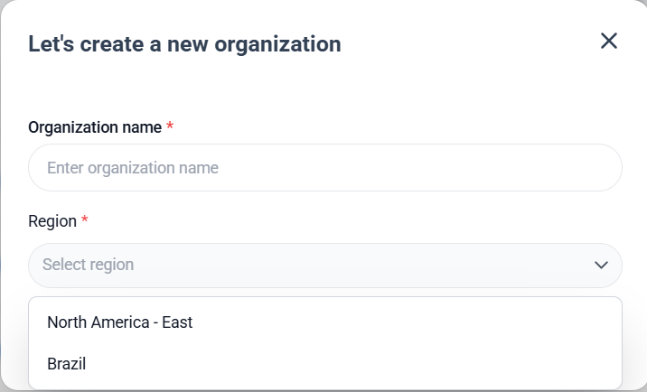
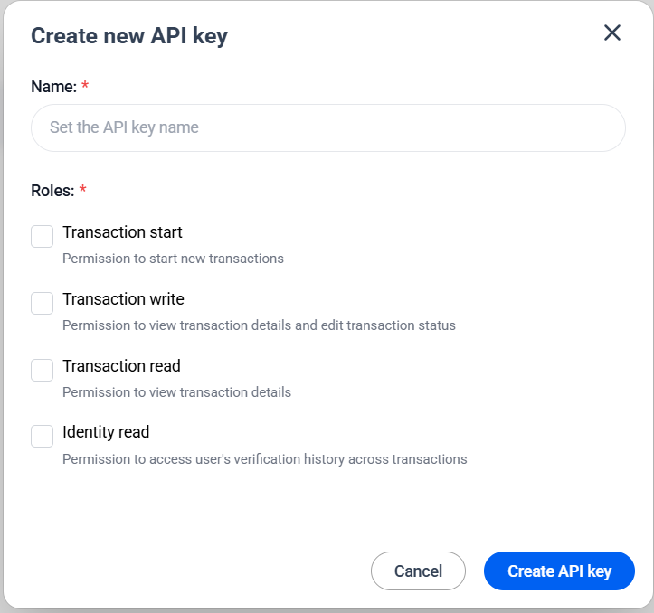
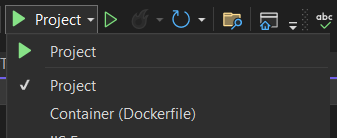
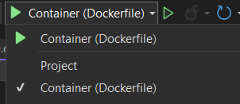
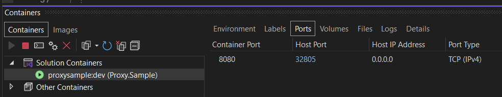
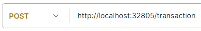
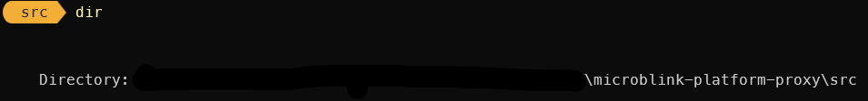
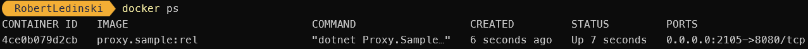

<p align="center" >
  
</p>

# Microblink Platform Transaction Proxy

Microblink Platform Transaction Proxy is lightweight .NET 9 service for secure and seamless authentication with Microblink Platform. 

## Table Of Contents

- [Provisioning](#provisioning)
- [Configuration](#configuration)
- [Proxy Test Run](#proxy-test-run)
    - [Run the service from VS](#scenario-1---run-the-service-from-visual-studio)
    - [Run the container from VS](#scenario-2---run-the-container-from-visual-studio)
    - [Run the docker container](#scenario-3---run-docker-container)
- [Start Transaction](#start-transaction)
- [Installation](#installation)

---


# Provisioning
- **Address** - depends on the region where Organization is hosted



## Address Table 
|    Region     |                   Value                                 |   Type   |
| ------------- | ------------------------------------------------------- | -------- |
|   `US - East` |  `https://api.us-east.platform.microblink.com/agent/`   | `string` |
|     `Brazil`  |  `https://api.br.platform.microblink.com/agent/`        | `string` |


<!-- - US-East - https://api.us-east.platform.microblink.com/agent/
- Brazil - https://api.br.platform.microblink.com/agent/ -->

## Client credentials

Generated at Microblink Platform Dashboard 

- **MANDATORY** role for PROXY - **Transaction start**



- **ClientId** - generated on image above
- **ClientSecret** - generated on image above

---

## Configuration

Microblink Platform Transaction Proxy configuration is done by adding configuration values in appsettings.json

| Property       | Type     | Required | Example                               | Description           |
| -------------- | -------- | -------- | ------------------------------------- | --------------------- |
| `Address`      | `string` | Yes      | `https://api.*.microblink.com/agent/` | Region specific URL   |
| `ClientId`     | `string` | Yes      | `QRl1pF4o1GQUPhfNaLjptL2PV7FCk2`      | Generate on Dashboard |
| `ClientSecret` | `string` | Yes      | `5eVolxANEx83732B5WFJgepzC2ovkh`      | Generate on Dashboard |

## Proxy Test Run

### Scenario 1 - Run the service from Visual Studio

1. Change **launchSettings.json** value for **applicationUrl** to match the url and port for your needs 
    -  In sample it was set to  "applicationUrl": "http://localhost:2105" 

2. Run the service from visual studio under **Project** settings



3. Service should be available from postman on port which was exposed


4. Proceed to steps [below](#start-transaction) to initiate transaction
---

### Scenario 2 - Run the container from Visual Studio

1. Run the service from visual studio as Container (Dockerfile)

   

2. Find where container is running in Visual Studio containers tab and copy host port



3. Prepare request for provided port



4. Proceed to steps [below](#start-transaction) to initiate transaction

---

### Scenario 3 - Run docker container

1. Open powershell and navigate to the root of the project 



2. Execute powershell script to start proxy

```powershell
> docker build -t proxy.sample:rel . # Building the image for run

# After the build is done execute
> docker run -p 2105:8080 proxy.sample:rel # Mapping host port 2105 to container 8080
```

3. Execute powershell script

```powershell
> docker ps
```


4. On image above it is seen exposed docker port **32805**. 

5. Prepare request for provided port


3. Excute postman request with setting shown below.


---
## Start Transaction

1. Pull the code from repository

2. Provide [Configuration](#configuration) values from Microblink Platform Dasbhboard - create API keys with **transaction.execute** permission.

3. Proxy API test - start the service and call it from postman

URL

```http
POST http://localhost:2105/transaction
# Change url to match one which you have set up in launchsettings.json
Content-Type: application/json
```

Body

```json
{
  "workflowId": "67a651aa5782356731276b99d", // Use your workflowId from Microblink Platform Dashboard
  "platform": "browser", // Example for browser SDK
  "sdkVersion": "0.1.0", // Must match workflow SDK version for provided workflowId
  "formFields": null
}
```

4. Response will return populated data

```json
{
  "transactionId": "",
  "workflowId": "67a651aa5782356731276b99d",
  "workflowVersionId": "",
  "organizationId": "",
  "ephemeralKey": "",
  "authorization": "",
  "workflowInfo": {
    "stepCount": 5,
    "interactiveStepCount": 2,
    "hasConditionalInteractiveStep": false,
    "interactiveSteps": [
      // Depends on workflow setup
      "DocVer",
      "FaceMatch"
    ],
    "completedInteractiveSteps": [],
    "currentStep": "Start",
    "currentStepRetryCount": 0,
    "currentStepExecutionIndex": 1
  },
  "createdOn": "",
  "modifiedOn": "",
  "processingStatus": "Pending",
  "warnings": [],
  "edgeApiUrl": "https://api.*.microblink.com/edge"
}
```

5. At this point Proxy API works. Expose the port to ensure your service is available outside of the server and provide SDKs with your new URL.

---

